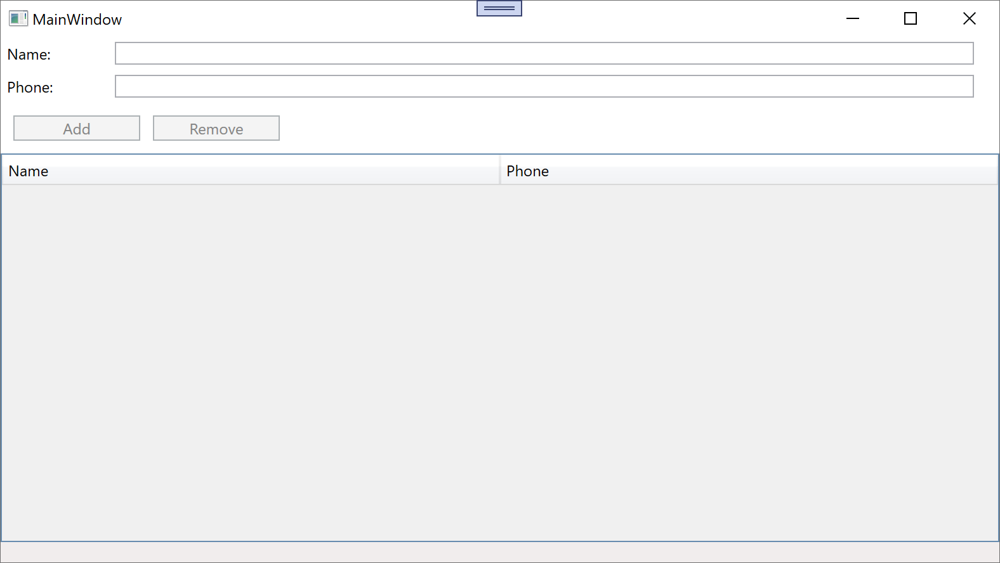
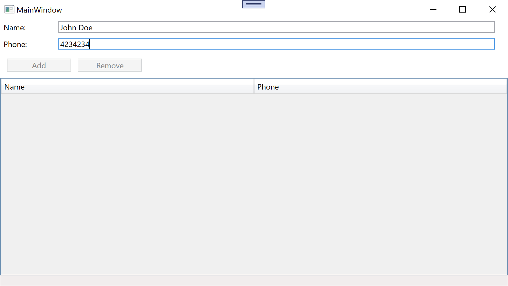
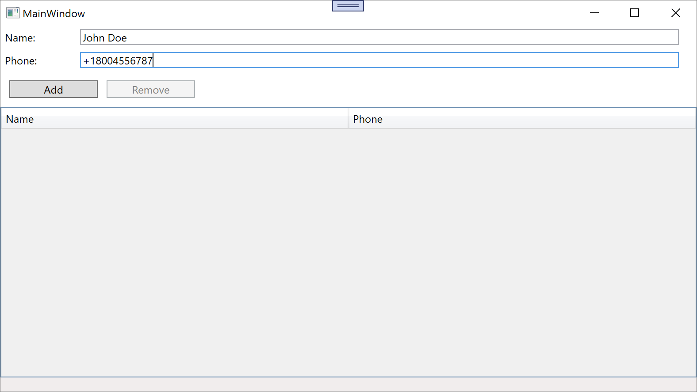
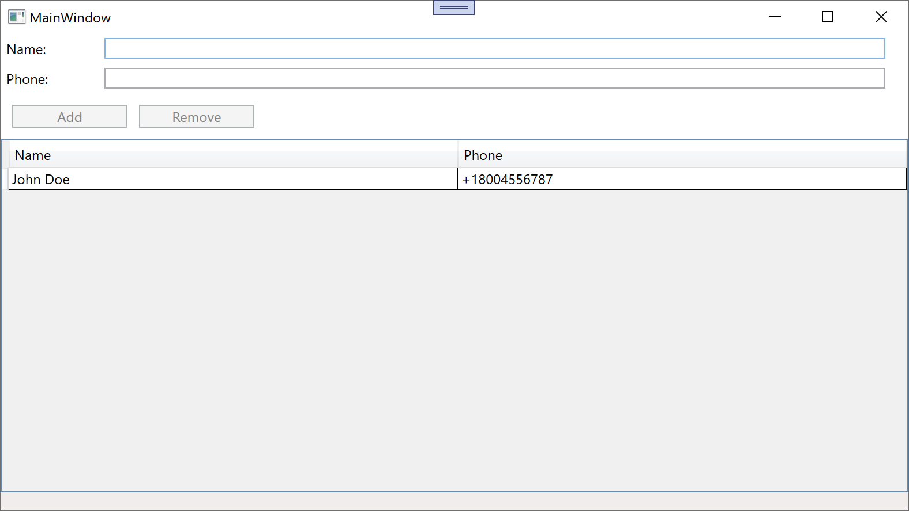
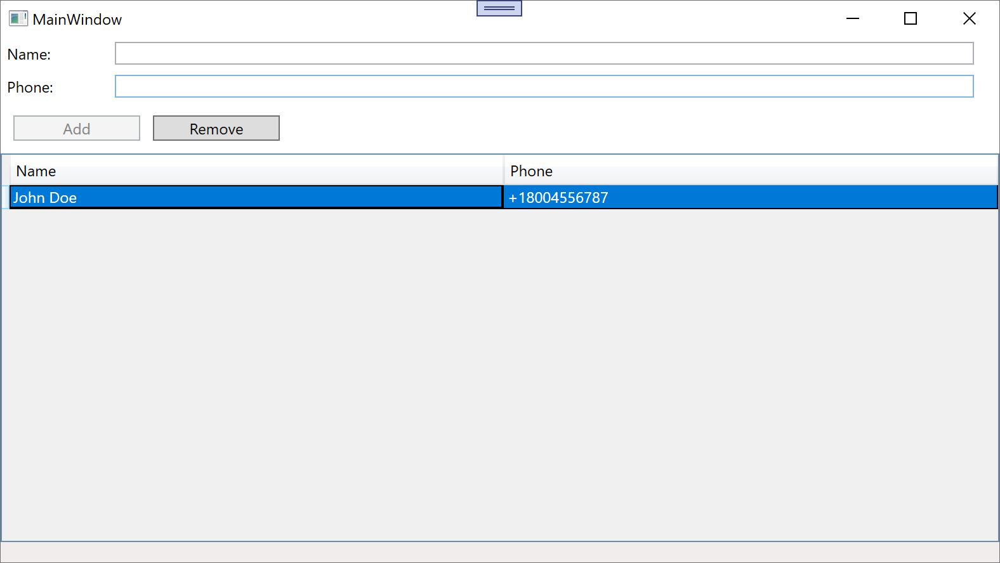

## Lab 9. MVVM: Basics
## Основы архитектурного шаблона MVVM
### Цель работы: 
Изучить архитектурный шаблон Model-View-ViewModel (MVVM) и закрепить практические навыки его применения при разработке настольных приложений на платформе Windows Presentation Foundation.
### Задание:
Разработать приложение «Телефонная книга» на платформе WPF с использованием паттерна MVVM. Приложение должно обеспечивать управление списком контактов (добавление, удаление, просмотр) и соответствовать следующим требованиям:
- Реализовать модель Contact с полями Name (имя контакта) и Phone (номер телефона).
- Создать ViewModel (MainViewModel) с командами добавления и удаления контактов
(AddCommand, DeleteCommand) Команда AddCommand – без параметра, DeleteCommand – с параметром.
- Использовать ObservableCollection для хранения списка контактов с автоматическим обновлением UI.
- Реализовать валидацию данных: имя контакта не должно быть пустым, номер телефона должен соответствовать формату (например, +7XXXXXXXXXX или без кода страны).
- Отображать список контактов в элементе DataGrid или ListView с возможностью выбора контакта для удаления.
- Обеспечить привязку данных (Data Binding) между XAML-разметкой и свойствами ViewModel.

--- 

## Step 1: Core and Models

### Theory

We need to crete core classes for MVVM that utilize `INotifyProperyChanged` and `ICommand` and a basic class for storing a contact

### Practice

Core Classes

`ObservableObject` has a `Set<T>` method that calls `PropertyChanged` handler 
```csharp
public abstract class ObservableObject : INotifyPropertyChanged
{
    public event PropertyChangedEventHandler? PropertyChanged;
    protected virtual void OnPropertyChanged([CallerMemberName] string? propertyName = null)
    {
        PropertyChanged?.Invoke(this,
        new PropertyChangedEventArgs(propertyName));
    }
    protected bool Set<T>(ref T field, T value,
    [CallerMemberName] string? propertyName = null)
    {
        if (EqualityComparer<T>.Default.Equals(field, value))
            return false;
        field = value;
        OnPropertyChanged(propertyName);
        return true;
    }
}
```
`RelayCommand` Has a `Execute` method that executes `Action`. Also has a `CanExecute` which controls ability to execute and also updates on `CommandManager.RequerySuggested`
```csharp
public class RelayCommand(Action execute, Func<bool>? canExecute = null) : ICommand
{
    private readonly Action _execute = execute;
    private readonly Func<bool>? _canExecute = canExecute;
    public bool CanExecute(object? parameter = null)
    => _canExecute?.Invoke() ?? true;
    public void Execute(object? parameter)
    {
        if (CanExecute(parameter)) _execute.Invoke();
    }
    public event EventHandler? CanExecuteChanged // delegates subscribers to CommandManager if something subscribes to it
    {
        add => CommandManager.RequerySuggested += value;
        remove => CommandManager.RequerySuggested -= value;
    }
}
```
And now with arguments
```csharp
public class RelayCommand<T>(Action<object?> execute, Predicate<object?>? canExecute = null) : ICommand
{
    private readonly Action<object?> _execute = execute ?? throw new
    ArgumentNullException(nameof(execute));
    private readonly Predicate<object?>? _canExecute = canExecute;
    public bool CanExecute(object? parameter)
    => _canExecute?.Invoke(parameter) ?? true;
    public void Execute(object? parameter)
    {
        if (CanExecute(parameter)) _execute.Invoke(parameter);
    }
    public event EventHandler? CanExecuteChanged
    {
        add => CommandManager.RequerySuggested += value;
        remove => CommandManager.RequerySuggested -= value;
    }
}
```

And `Contact` as our basic model
```csharp
public class Contact : ObservableObject
{
    private int _id;
    private string _name;
    private string _phone;
    public string Name
    {
        get { return _name; }
        set
        {
            _name = value.Trim();
            Set(ref _name, value);
        }
    }
    public string Phone
    {
        get { return _phone; }
        set
        {
            if (IsPhoneValid(value.Trim()))
                Set(ref _phone, value);
        }
    }
    public Contact(int id, string name, string phone)
    {
        _id = id;
        _name = name;
        _phone = phone;
    }
    public bool Validate()
    {
        return (!string.IsNullOrEmpty(Name) && !string.IsNullOrEmpty(Phone) && IsPhoneValid(Phone));
    }
    private bool IsPhoneValid(string phone)
    {
        return (phone.StartsWith('+') && phone.Substring(1, phone.Length - 1).All(char.IsDigit) && phone.Length <= 13);
    }
    public override string ToString()
    {
        return $"{Name} : {Phone}";
    }
}
```

---

## Step 2: ViewModel

### Theory

Now let's create a ViewModel that our View will bind to

### Practice

```csharp
public class MainViewModel : ObservableObject
{
    public ObservableCollection<Contact> Contacts { get; }

    private string _name = string.Empty;
    private string _phone = string.Empty;
    private Contact? _selectedContact;
    private int id = 0;

    public string Name
    {
        get => _name;
        set => Set(ref _name, value);
    }
    public string Phone
    {
        get => _phone;
        set => Set(ref _phone, value);
    }
    public Contact? SelectedContact
    {
        get => _selectedContact;
        set => Set(ref _selectedContact, value);
    }

    public ICommand AddCommand { get; }
    public ICommand DeleteCommand { get; }

    public MainViewModel()
    {
        Contacts = new ObservableCollection<Contact>();
        AddCommand = new RelayCommand(
        AddContact,
        CanAddContact);

        DeleteCommand = new RelayCommand(
        DeleteContact,
        CanDeleteContact);
    }

    private void AddContact()
    {
        Contact c = new Contact(id++, Name, Phone);
        if (c.Validate())
        {
            Contacts.Add(c);
            Name = string.Empty;
            Phone = string.Empty;
        }
    }
    private bool CanAddContact() => !string.IsNullOrEmpty(Name) && !string.IsNullOrEmpty(Phone) && Contact.IsPhoneValid(Phone);

    private void DeleteContact()
    {
        if (SelectedContact is not null && Contacts.Contains(SelectedContact))
            Contacts.Remove(SelectedContact);
    }
    private bool CanDeleteContact() => SelectedContact is not null;
}
```

## Step 3: View

### Theory

The UI. We set `DataContext` to our `MainViewModel` and bind to its properties and commands

### In MainWindow.xaml

```xml
<Window x:Class="PhoneBook.Views.MainWindow"
        xmlns="http://schemas.microsoft.com/winfx/2006/xaml/presentation"
        xmlns:x="http://schemas.microsoft.com/winfx/2006/xaml"
        xmlns:d="http://schemas.microsoft.com/expression/blend/2008"
        xmlns:mc="http://schemas.openxmlformats.org/markup-compatibility/2006"
        xmlns:local="clr-namespace:PhoneBook"
        xmlns:vm="clr-namespace:PhoneBook.ViewModels" 
        mc:Ignorable="d"
        Title="MainWindow" Height="450" Width="800">
    <Window.DataContext>
        <vm:MainViewModel />
    </Window.DataContext>
    <Grid>
        <Grid.RowDefinitions>
            <RowDefinition Height="Auto"/>
            <RowDefinition Height="Auto"/>
            <RowDefinition Height="Auto"/>
            <RowDefinition Height="*"/>
            <RowDefinition Height="Auto"/>
        </Grid.RowDefinitions>
        <DockPanel Grid.Row="0" >
            <Label Content="Name:" Width="70"/>
            <TextBox  Margin="20, 0" HorizontalAlignment="Stretch" VerticalAlignment="Center" Text="{Binding Name, UpdateSourceTrigger=PropertyChanged}"/>
        </DockPanel>

        <DockPanel Grid.Row="1" >
            <Label Content="Phone:" Width="70"/>
            <TextBox  Margin="20, 0" HorizontalAlignment="Stretch" VerticalAlignment="Center" Text="{Binding Phone, UpdateSourceTrigger=PropertyChanged}"/>
        </DockPanel>
        <StackPanel Grid.Row="2" Orientation="Horizontal" Margin="10">
            <Button Content="Add" Width="100" Margin="0,0,10,0" Command="{Binding AddCommand}"/>
            <Button Content="Remove" Width="100" Command="{Binding DeleteCommand}"/>
        </StackPanel>
        <DataGrid Grid.Row="3" AutoGenerateColumns="False" IsReadOnly="True"
            ItemsSource="{Binding Contacts}"
            SelectedItem="{Binding SelectedContact}">
            <DataGrid.Columns>
                <DataGridTextColumn Header="Name" Width="*" Binding="{Binding Path=Name}"/>
                <DataGridTextColumn Header="Phone" Width="*" Binding="{Binding Path=Phone}"/>
            </DataGrid.Columns>
        </DataGrid>

        <StatusBar Grid.Row="5">
            <Label Content="{Binding ErrorMsg}"/>
        </StatusBar>
    </Grid>
</Window>
```

*Output*







### Summary
I've successfully implemented MVVM pattern