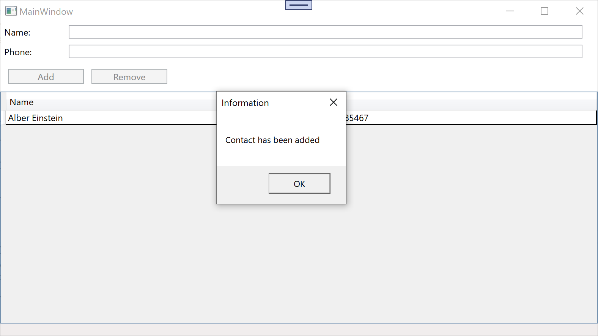
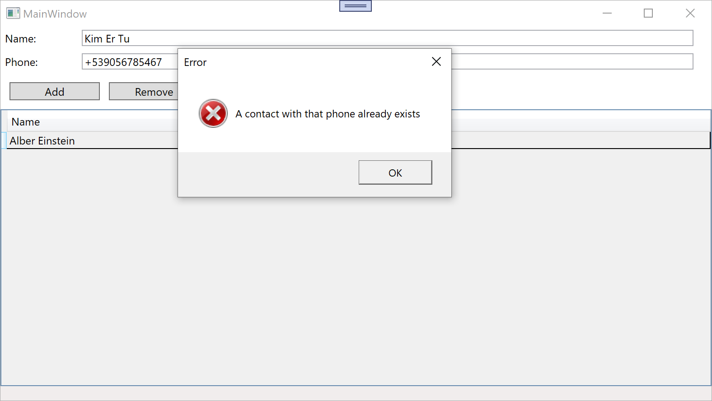
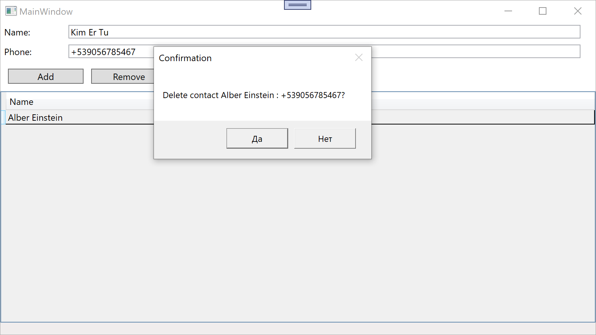

## Lab 10. MVVM: Dependency Injection, Service Pattern
## Dependency Injection и паттерн «Сервис» в MVVM-приложениях
### Цель работы: 
изучить принцип внедрения зависимостей (Dependency Injection, DI) и паттерн «Сервис» для решения проблемы жёсткой связности компонентов в MVVM-приложениях.

### Задание:
Выполнить рефакторинг приложения «Телефонная книга» из Лабораторной работы №9 с применением паттернов Dependency Injection и Service.

--- 

### Theory

So we want to have a cross-platform and framework-independent solution. But what if we need to call a platform-specific function? 

We can utilize Service pattern. We're going to have a service interface that other app components communicate with. And a service implementation that talks with framework and system libraries.

And we're going to implement our services via Dependecy Injection 

### Practice

Service interface
```csharp
public interface IDialogService
{
    public void ShowInfo(string message, string title = "Information");
    public void ShowError(string message = "An error has occured", string title = "Error");
    public bool GetConfirm(string message = "Proceed?", string title = "Confirmation");
}
```

Service implementation 
```csharp
public class WPFDialogService : IDialogService
{
    public void ShowInfo(string message, string title = "Information") =>
        MessageBox.Show(message, title);
    public void ShowError(string message = "An error has occured", string title = "Error") =>
        MessageBox.Show(message, title, MessageBoxButton.OK, MessageBoxImage.Error);
    public bool GetConfirm(string message = "Proceed?", string title = "Confirmation")
    {
        MessageBoxResult result = MessageBox.Show(message, title, MessageBoxButton.YesNo);
        return result == MessageBoxResult.Yes;
    }
}
```

Let's now call our service from `MainViewModel`
```csharp
public class MainViewModel : ObservableObject
{
    // ...
    private IDialogService _dialogService;
    // ...
    public MainViewModel(IDialogService ds) // now with args!!!
    {
        _dialogService = ds;
        // ...
    }
    // ...
    private void AddContact()
    {
        Contact c = new Contact(id++, Name, Phone);
        if (c.Validate())
        {
            if (Contacts.Any(c => c.Phone == _phone))
            {
                _dialogService.ShowError("A contact with that phone already exists"); // Dialog window
            }
            else
            {
                Contacts.Add(c);
                Name = string.Empty;
                Phone = string.Empty;
                _dialogService.ShowInfo("Contact has been added"); // Dialog window
            }
        }
    }
    // ...
    private void DeleteContact()
    {
        if (SelectedContact is not null && Contacts.Contains(SelectedContact))
        {
            if (_dialogService.GetConfirm($"Delete contact {SelectedContact}?")) // Dialog window
            {
                Contacts.Remove(SelectedContact);
            }
        }
    }
    // ,,,
}
```

But now, `MainViewModel` constructor requires an argument that we can't provide via xaml. We could set dialog service in `*.xaml.cs` that WPF has, but it would violate Single Responsibility Principle

Instead, let's use Dependency Injection and let's initialize our service provider inside `App.xaml.cs`

```csharp
public partial class App : Application
{
    protected override void OnStartup(StartupEventArgs e)
    {
        base.OnStartup(e);
        var services = new ServiceCollection();

        services.AddSingleton<IDialogService, WPFDialogService>(); // DialogService doesn't store any info
        services.AddTransient<MainViewModel>(); // ViewModel does store info and *in theory* we would want to have different copies of that
        services.AddSingleton<MainWindow>(sp => // We don't want to have multiple copies of MainWindow
        {   // Factory delegate (recipe)
            var window = new MainWindow();
            window.DataContext = sp.GetRequiredService<MainViewModel>(); // (Lazy) init of MainViewModel
            return window;
        });

        // Provider gets services from the ServiceCollection and its services can't be changed from now on
        var serviceProvider = services.BuildServiceProvider(); 

        var mainWindow = serviceProvider.GetRequiredService<MainWindow>(); // (Lazy) init of MainWindow
        mainWindow.Show();
    }
}
```
In `App.xaml`
```xml
<Application x:Class="PhoneBook.App"
             xmlns="http://schemas.microsoft.com/winfx/2006/xaml/presentation"
             xmlns:x="http://schemas.microsoft.com/winfx/2006/xaml"
             xmlns:local="clr-namespace:PhoneBook">
<!-- Removed: StartupUri="Views/MainWindow.xaml"> -->
```
In `MainWindow.xaml` removed this
```xml
<!-- 
<Window.DataContext>
    <vm:MainViewModel />
</Window.DataContext> 
-->
```

*Output*




### Summary
I've successfully utilized Dependecy Injection and implemented Service pattern