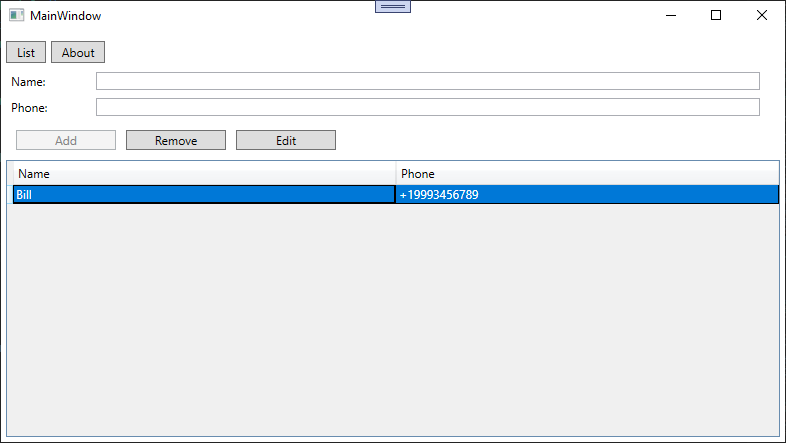
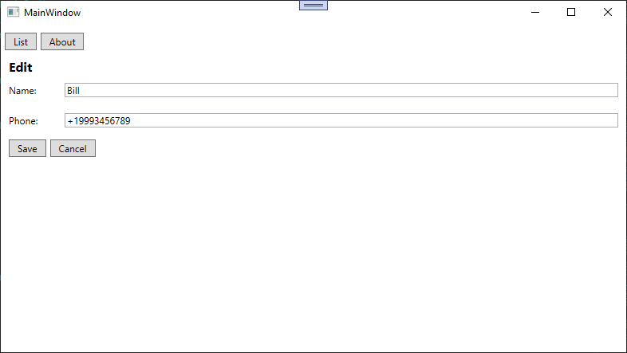
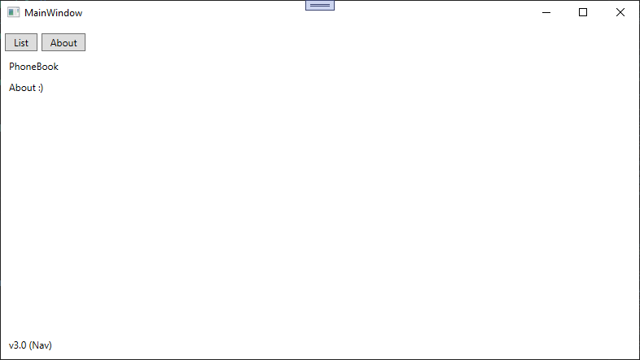

## Lab 11. MVVM: Navigation via IoC
## Навигация в MVVM-приложениях
### Цель работы: 
изучить механизмы навигации между экранами в MVVM-приложении без использования стандартных средств WPF (Frame/Page).

### Задание:
Выполнить рефакторинг приложения «Телефонная книга» в архитектуру Shell (Оболочка).

--- 

### Theory

So we want a page navigation. But how to do without violating SOLID? We can delegate Navigation to one object *(to rule them all!)* 

### Practice

Let's create navigation service

```csharp
public interface INavigationService
{
    ViewModelBase? CurrentViewModel { get; }
    void NavigateTo<T>(object? parameter = null)
    where T : ViewModelBase;
}
```
```csharp
public class NavigationService : ObservableObject, INavigationService
{
    private readonly IServiceProvider _serviceProvider;
    private ViewModelBase? _currentViewModel;
    public NavigationService(IServiceProvider serviceProvider)
    {
        _serviceProvider = serviceProvider;
    }
    public ViewModelBase? CurrentViewModel
    {
        get => _currentViewModel;
        private set
        {
            _currentViewModel = value;
            OnPropertyChanged();
        }
    }
    public void NavigateTo<T>(object? parameter = null) where T : ViewModelBase
    {
        var vm = _serviceProvider.GetRequiredService<T>(); // Get ViewModel from IoC
        vm.OnNavigatedTo(parameter);
        CurrentViewModel = vm;
    }
}
```

We need to have a navigation aware object's interface (so they can be navigated no matter what type they are)
```csharp
public interface INavigationAware
{
    void OnNavigatedTo(object? parameter);
}
```

And let's make a base class to hold the navgiation service
```csharp
public class ViewModelBase : ObservableObject, INavigationAware
{
    public readonly INavigationService _navigation;
    public ViewModelBase(INavigationService navigation)
    {
        _navigation = navigation;
    }

    // When ViewModel is being navigated to
    public virtual void OnNavigatedTo(object? parameter) { }
}
```

Let's add service to `App.xaml.cs` near our dialog service
```csharp
public partial class App : Application
{
    protected override void OnStartup(StartupEventArgs e)
    {
        // ...
        // Services
        services.AddSingleton<IDialogService, WPFDialogService>(); // DialogService doesn't store any info
        services.AddSingleton<INavigationService, NavigationService>();
        //....
    }
}
```

And now we need to have a `MainWindow` to actually support this system
```csharp
public class MainWindowViewModel : ViewModelBase
{
    public INavigationService NavigationService
    {
        get => _navigation;
    }
    public ICommand ShowContactsCommand { get; }
    public ICommand ShowAboutCommand { get; }

    public MainWindowViewModel(INavigationService navigation) : base(navigation)
    {
        ShowContactsCommand = new RelayCommand(
            () => _navigation.NavigateTo<ContactListViewModel>());
        ShowAboutCommand = new RelayCommand(
            () => _navigation.NavigateTo<AboutViewModel>());
        
        _navigation.NavigateTo<ContactListViewModel>();
    }
}
```
We need to change `MainWindow` to have an area for pages
```xml
<Window x:Class="PhoneBook.Views.MainWindow"
        ...
        Title="MainWindow" Height="450" Width="800">
    <DockPanel Margin="5">
        <StackPanel DockPanel.Dock="Top" Orientation="Horizontal">
            <Button Content="List" Command="{Binding ShowContactsCommand}" Margin="0,5,5,5" Padding="10,2"/>
            <Button Content="About" Command="{Binding ShowAboutCommand}" Margin="0,5,5,5" Padding="10,2"/>
        </StackPanel>
        <ContentControl Content="{Binding NavigationService.CurrentViewModel}" />
    </DockPanel>
</Window>
```

Alright, now we need to actually add pages that we are going to navigate to


Contact list
```csharp
 public class ContactListViewModel : ViewModelBase
 {
     public ObservableCollection<Contact> Contacts { get; }

     private string _name = string.Empty;
     private string _phone = string.Empty;
     private Contact? _selectedContact;
     private IDialogService _dialogService;
     private int id = 0;

     public string Name
     {
         get => _name;
         set => Set(ref _name, value);
     }
     public string Phone
     {
         get => _phone;
         set => Set(ref _phone, value);
     }
     public Contact? SelectedContact
     {
         get => _selectedContact;
         set => Set(ref _selectedContact, value);
     }

     public ICommand AddCommand { get; }
     public ICommand DeleteCommand { get; }
     public ICommand EditCommand { get; }
     public ContactListViewModel(IDialogService ds, INavigationService navigation) : base(navigation)
     {
         _dialogService = ds;
         Contacts = new ObservableCollection<Contact>();
         AddCommand = new RelayCommand(
             AddContact,
             CanAddContact);

         DeleteCommand = new RelayCommand(
             DeleteContact,
             CanEditContact);

         EditCommand = new RelayCommand(
             () => _navigation.NavigateTo<ContactEditViewModel>(SelectedContact),
             CanEditContact);
     }

     private void AddContact()
     {
         Contact c = new Contact(id++, Name, Phone);
         if (c.Validate())
         {
             if (Contacts.Any(c => c.Phone == _phone))
             {
                 _dialogService.ShowError("A contact with that phone already exists");
             }
             else
             {
                 Contacts.Add(c);
                 Name = string.Empty;
                 Phone = string.Empty;
                 _dialogService.ShowInfo("Contact has been added");
             }
         }
     }
     private bool CanAddContact() => !string.IsNullOrEmpty(Name) && !string.IsNullOrEmpty(Phone) && Contact.IsPhoneValid(Phone);

     private void DeleteContact()
     {
         if (SelectedContact is not null && Contacts.Contains(SelectedContact))
         {
             if (_dialogService.GetConfirm($"Delete contact {SelectedContact}?"))
             {
                 Contacts.Remove(SelectedContact);
             }
         }
     }
     private bool CanEditContact() => SelectedContact is not null;
 }
```
```xml
<UserControl x:Class="PhoneBook.Views.ContactListView"
            ...
             d:DesignHeight="450" d:DesignWidth="800">
    <Grid>
        <Grid.RowDefinitions>
            <RowDefinition Height="Auto"/>
            <RowDefinition Height="Auto"/>
            <RowDefinition Height="Auto"/>
            <RowDefinition Height="*"/>
            <RowDefinition Height="Auto"/>
        </Grid.RowDefinitions>
        <DockPanel Grid.Row="0" >
            <Label Content="Name:" Width="70"/>
            <TextBox  Margin="20, 0" HorizontalAlignment="Stretch" VerticalAlignment="Center" Text="{Binding Name, UpdateSourceTrigger=PropertyChanged}"/>
        </DockPanel>

        <DockPanel Grid.Row="1" >
            <Label Content="Phone:" Width="70"/>
            <TextBox  Margin="20, 0" HorizontalAlignment="Stretch" VerticalAlignment="Center" Text="{Binding Phone, UpdateSourceTrigger=PropertyChanged}"/>
        </DockPanel>
        <StackPanel Grid.Row="2" Orientation="Horizontal" Margin="10">
            <Button Content="Add" Width="100" Margin="0,0,10,0" Command="{Binding AddCommand}"/>
            <Button Content="Remove" Width="100" Margin="0,0,10,0" Command="{Binding DeleteCommand}"/>
            <Button Content="Edit" Width="100" Margin="0,0,10,0" Command="{Binding EditCommand}"/>
        </StackPanel>
        <DataGrid Grid.Row="3" AutoGenerateColumns="False" IsReadOnly="True"
        ItemsSource="{Binding Contacts}"
        SelectedItem="{Binding SelectedContact}">
            <DataGrid.Columns>
                <DataGridTextColumn Header="Name" Width="*" Binding="{Binding Path=Name}"/>
                <DataGridTextColumn Header="Phone" Width="*" Binding="{Binding Path=Phone}"/>
            </DataGrid.Columns>
        </DataGrid>
    </Grid>
</UserControl>
```

Contact edit
```csharp
public class ContactEditViewModel : ViewModelBase
{
    private Contact _contact = null!;
    public string EditName
    {
        get => _contact.Name;
        set 
        { 
            _contact.Name = value; 
            OnPropertyChanged(); 
        }
    }
    public string EditPhone
    {
        get => _contact.Phone;
        set 
        { 
            _contact.Phone = value; 
            OnPropertyChanged(); 
        }
    }
    public ICommand SaveCommand { get; }
    public ICommand CancelCommand { get; }
    public ContactEditViewModel(INavigationService navigation) : base(navigation)
    {
        SaveCommand = new RelayCommand(
            () => _navigation.NavigateTo<ContactListViewModel>());
        CancelCommand = new RelayCommand(
            () => _navigation.NavigateTo<ContactListViewModel>());
    }
    public override void OnNavigatedTo(object? parameter)
    {
        if (parameter is Contact c) 
            _contact = c;
    }
}
```

```xml
<UserControl x:Class="PhoneBook.Views.ContactEditView"
            ...
             d:DesignHeight="450" d:DesignWidth="800">
    <Grid Margin="5">
        <StackPanel>
            <TextBlock Text="Edit" FontSize="16" FontWeight="Bold" />
            <Grid>
                <Grid.RowDefinitions>
                    <RowDefinition />
                    <RowDefinition/>
                </Grid.RowDefinitions>
                <Grid.ColumnDefinitions>
                    <ColumnDefinition Width="70"/>
                    <ColumnDefinition />
                </Grid.ColumnDefinitions>
                
                <TextBlock Grid.Row="0" Grid.Column="0" VerticalAlignment="Center">Name:</TextBlock>
                <TextBox Grid.Row="0" Grid.Column="1" Text="{Binding EditName, UpdateSourceTrigger=PropertyChanged}" Margin="0,10"/>

                <TextBlock Grid.Row="1" Grid.Column="0" VerticalAlignment="Center">Phone:</TextBlock>
                <TextBox Grid.Row="1" Grid.Column="1" Text="{Binding EditPhone}" Margin="0,10"/>
            </Grid>
            <StackPanel Orientation="Horizontal">
                <Button Content="Save" Command="{Binding SaveCommand}" Margin="0,5,5,5" Padding="10,2"/>
                <Button Content="Cancel" Command="{Binding CancelCommand}" Margin="0,5,5,5" Padding="10,2"/>
            </StackPanel>
        </StackPanel>
    </Grid>
</UserControl>
```


About
```csharp
public class AboutViewModel : ViewModelBase
{
    public string AppName => "PhoneBook";
    public string Version => "v3.0 (Nav)";
    public AboutViewModel(INavigationService nav) : base(nav) {}
}
```

```xml
<UserControl x:Class="PhoneBook.Views.AboutView"
            ...
             d:DesignHeight="450" d:DesignWidth="800">
    <Grid>
        <DockPanel>
            <Label DockPanel.Dock="Top" Content="{Binding AppName}"/>
            <Label DockPanel.Dock="Bottom" Content="{Binding Version}"/>
            <Label Content="About :)"/>
        </DockPanel>
    </Grid>
</UserControl>
```

And now we need to change `App.xaml` to include these additions. We are assigning views to viewmodels here

```xml
<Application x:Class="PhoneBook.App"
             xmlns="http://schemas.microsoft.com/winfx/2006/xaml/presentation"
             xmlns:x="http://schemas.microsoft.com/winfx/2006/xaml"
             xmlns:local="clr-namespace:PhoneBook"
             xmlns:vm="clr-namespace:PhoneBook.ViewModels"
             xmlns:views="clr-namespace:PhoneBook.Views"
             >
    <Application.Resources>
        <DataTemplate DataType="{x:Type vm:ContactListViewModel}">
            <views:ContactListView />
        </DataTemplate>
        <DataTemplate DataType="{x:Type vm:AboutViewModel}">
            <views:AboutView />
        </DataTemplate>
        <DataTemplate DataType="{x:Type vm:ContactEditViewModel}">
            <views:ContactEditView />
        </DataTemplate>
    </Application.Resources>
</Application>
```

And `App.xaml.cs`

```csharp
public partial class App : Application
{
    protected override void OnStartup(StartupEventArgs e)
    {
        ...
        // ViewModels
        services.AddSingleton<ContactListViewModel>();
        services.AddTransient<AboutViewModel>();
        services.AddTransient<ContactEditViewModel>();
        services.AddSingleton<MainWindowViewModel>();

        // MainWindow
        services.AddSingleton<MainWindow>(sp => // We don't want multiple copies of MainWindow
        {   // Factory delegate (recipe)
            var window = new MainWindow();
            window.DataContext = sp.GetRequiredService<MainWindowViewModel>(); // (Lazy) init of MainViewModel
            return window;
        });
    }
}
```

*Output*





### Summary
I've successfully implemented Navigation as an IoC Service